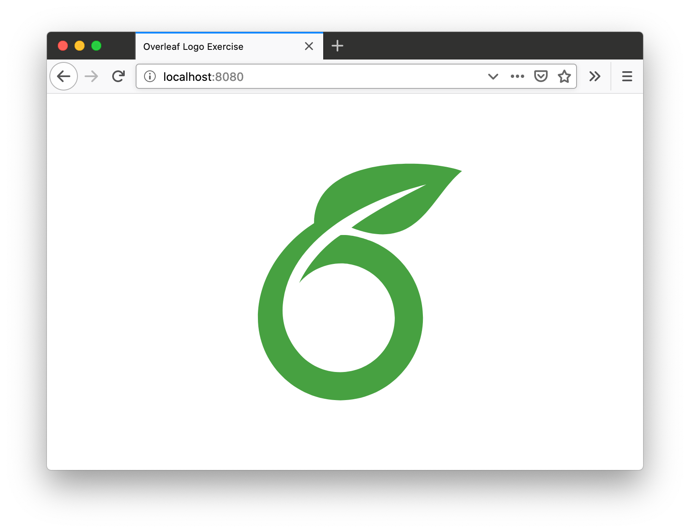

# Overleaf Logo Exercise


Display the Overleaf logo in any color you like! (This is an application we sometimes use for interview questions.)



## Installation

The application is available via Docker:

```
docker pull overleaf/logo-exercise
```

Or you can run the application locally if you have `node` installed (version 10+ required).

```
git clone git@github.com:overleaf/logo-exercise.git
cd logo-exercise
npm install
npm start
```

## Configuration

The application accepts configuration via two environment variables:

- `PORT` (required): the port number to listen on
- `COLOR` (optional; default `blue`): the color of the logo, as a [web color](https://en.wikipedia.org/wiki/Web_colors#HTML_color_names) name or hexadecimal RGB value

## Development

If you'd like to read the code, the most important files are:

- [`./server.js`](./server.js) --- entry point that runs the express application
- [`./src/app.js`](./src/app.js) --- the express application
- [`./views/index.pug`](./views/index.pug) --- the HTML page comes from here

There is also a basic test in, which you can run locally with `npm test`.
